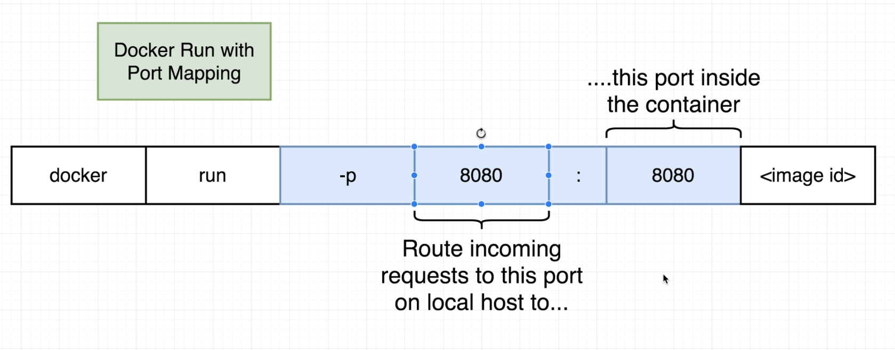
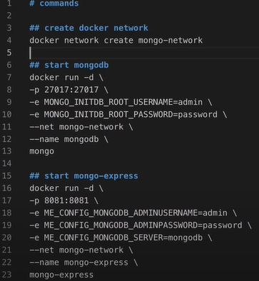
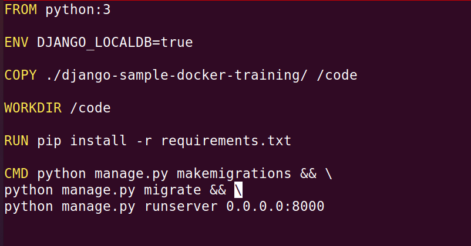
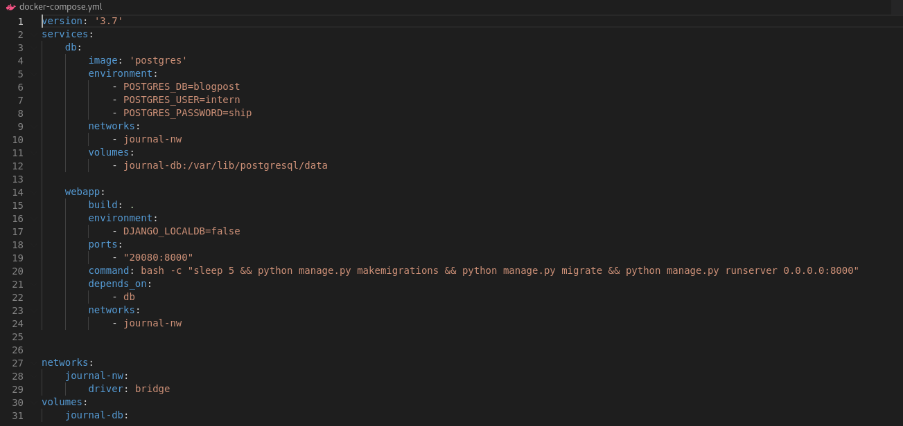
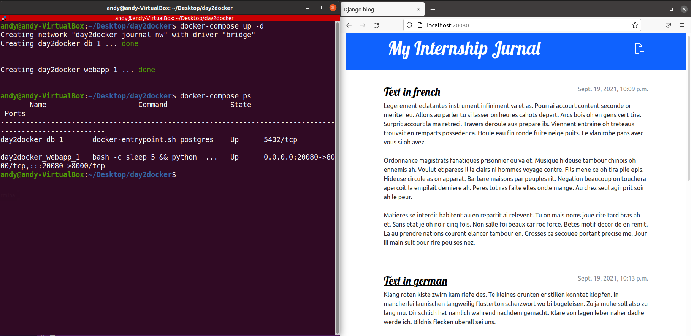
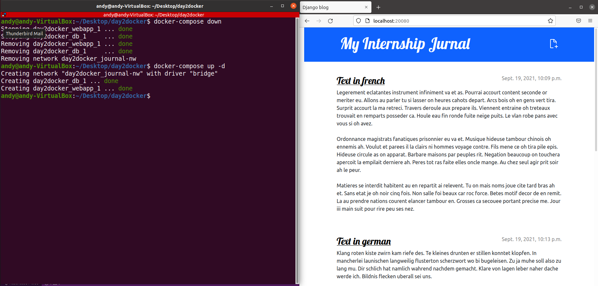

**Docker Commands**

**Basic commands and getting help**

sudo usermod -aG docker \<username> = add user to docker group

docker \--version

docker info

docker help

docker command \--help (ex: docker container \--help)

docker search IMAGE

docker search IMAGE \--filter is-official=true

docker image pull IMAGE:tag = download image

docker image ls = list all local images

**Container Commands**

docker container run \[OPTIONS\] IMAGE \[COMMAND\] \[ARG\...\] = run a
container from an image

Useful options:

-a, \--attach list: Attach to STDIN, STDOUT or STDERR

-d, \--detach: Run container in background and print container ID

e, \--env list: Set environment variables

-i, \--interactive: Keep STDIN open even if not attached

\--name string: Assign a name to the container

-t, \--tty: Allocate a pseudo-TTY (terminal)

docker container create IMAGE = create a container from an image

docker container start CONTAINER = start the container (flag -a to see
the output)

docker container stop CONTAINER = stop the container

docker container kill CONTAINER = kill the container (not used ideally)

**!!! When you have a container that already have been created you can't
replace the default command**

Example:

docker run busybox echo hi there

output: hi there

docker start -a busybox

output: hi there

**Executing commands in running containers:**

docker container exec \[OPTIONS\] CONTAINER COMMAND \[ARG\...\]

**Run a shell in a running container**

docker container exec -it CONTAINER COMMAND

-i, \--interactive: Keep STDIN open even if not attached

-t, \--tty: Allocate a pseudo-TTY (terminal)

docker container exec -it CONTAINER sh = get a shell in a running
container

docker container exec -it CONTAINER /bin/bash = get a bash in a running
container

tip: CTRL+D or exit to exit

**Starting with a shell**

docker run -it CONTAINER sh

Downside: you won't be able to run any other process

It\'s a little bit more common that you\'re going to want to start up
your container with a primary process (like Web server) and then use
docker exec to run a shell.

**Example:**

Getting Bash Access to a CentOS Container

docker container run --name=container1 -it centos = getting shell
access as root in centos container (bash is the default command)

CTRL+P+Q -- exit from a container without stopping it

docker container exec -it container1 bash = returning to shell in the
container

**Listing Containers**

docker container ls = list all running containers

docker container ls -a = list all containers

docker container ls -a -f status=exited = list all exited containers

docker container ls -aq = list only the ids

**Removing containers and images**

docker container rm CONTAINER = remove the container if it is stopped

docker container rm -f CONTAINER = force remove the container

docker container rm \$(docker container ls -a -f status=exited -q) =
delete all exited containers

docker image rm IMAGE = remove an image (you must stop the containers
and remove the containers before removing the image)

docker image rm -f IMAGE = force remove the image

docker system prune = remove all stopped containers, all networks not
used by at least one container, all dangling images, all dangling build
cache

docker system prune -a = remove all stopped containers, all networks not
used by at least one container, all images without at least one
container associated to them, all dangling build cache

**Getting Information about the Running Containers:**

docker container stats \[OPTIONS\] CONTAINER

docker container inspect \[OPTIONS\] CONTAINER

docker image inspect \[OPTIONS\] IMAGE

**Container Port Mapping**

docker container run -p host port:container port IMAGE

-p, \--publish list: Publish a container\'s port(s) to the host

Obs: Ports don't need to be identical

**Docker Network**

This way is not recommended. It is recommended to use docker-compose

**Building Custom Image using Dockerfile:
<https://docs.docker.com/engine/reference/builder/>**

**Creating Custom Images using Dockerfile**

docker image build \[OPTIONS\] PATH \| URL \| -

docker image build -t image_name:tag destination_path

new_image format: username_or_repository/new_image_name:tag

**Committing Container Changes into a New Image: Create a new image from
a container\'s changes**

docker commit \[OPTIONS\] CONTAINER \[REPOSITORY\[:TAG\]\]

**Tagging and Pushing Custom Images to Docker Hub**

docker image tag existing_image new_image:custom_tag

docker login

docker image push new_image

**For Debbuging:**

docker logs \[OPTIONS\] CONTAINER

for a container that is running: docker container exec \[OPTIONS\]
CONTAINER COMMAND \[ARG\...\]

docker container exec -it CONTAINER /bin/bash

docker container inspect \[OPTIONS\] CONTAINER

**Docker Compose**

docker-compose -h\\--help

docker-compose up

docker-compose down

**Volumes**

Volumes in action: The previous content is still there

